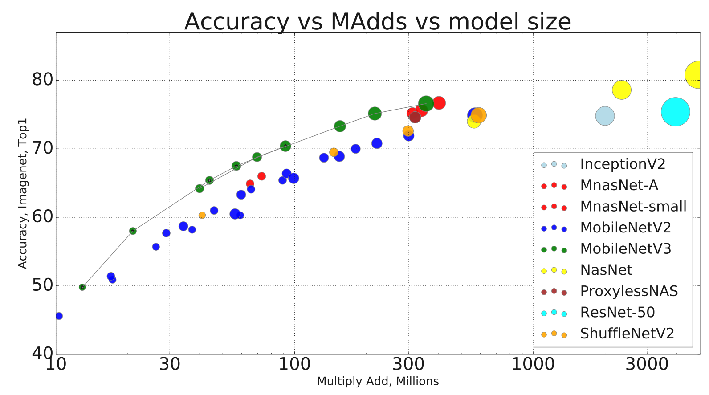
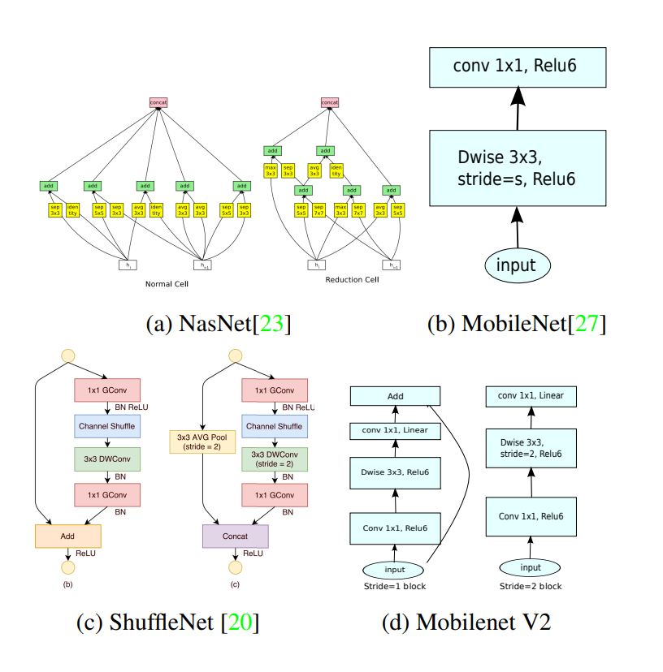
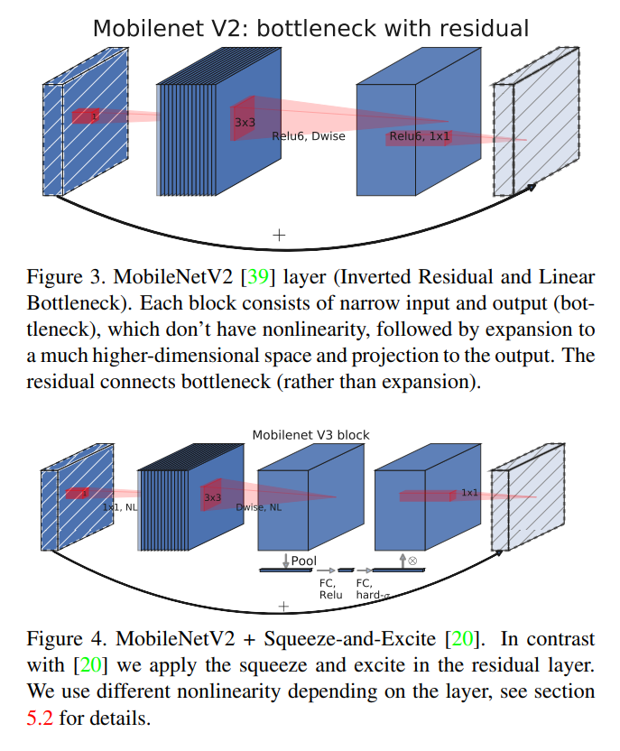

## MobileNet
[](https://github.com/Shubhamai/pytorch-mobilenet/blob/main/LICENSE)

This repo contains the following implementations from scratch using PyTorch : 
- [`MobileNetV1.py`](/MobileNetV1.py) : [MobileNets: Efficient Convolutional Neural Networks for Mobile Vision Applications](https://arxiv.org/abs/1704.04861)
- [`MobileNetV2.py`](/MobileNetV2.py) : [MobileNetV2: Inverted Residuals and Linear Bottlenecks](https://arxiv.org/abs/1801.04381). 
- [`MobileNetV3.py`](MobileNetV3.py) : [Searching for MobileNetV3](https://arxiv.org/abs/1905.02244v5)

## Table of Contents

- [MobileNet](#mobilenet)
- [Table of Contents](#table-of-contents)
- [What is MobileNet?](#what-is-mobilenet)
- [Usage](#usage)
- [Notes](#notes)
- [Acknowledgments](#acknowledgments)
- [Citation](#citation)

## What is MobileNet?

The main idea behind MobileNet(s) is to create efficient neural networks to make them viable for real-time mobile and embedded devices. The architecture(s) have shown high efficiency in tasks like image classification, object detection, and semantic segmentation in mobile devices with low latency and high accuracy. 


<p align="center">

</p>

The key takeaways for the paper(s) are -

1. MobileNetv1
   1. Using Depthwise Separable Convolution with Pointwise Convolution instead of standard convolution substantially decreases the number of parameters making CNN more viable for mobile & embedded devices.   
2. MobileNetv2
   1. It improves on MobileNetv1 by using *linear bottleneck with inverted residuals and depwise seperable convolution* and it's main building block. It does sounds very mountful but is simply a combination of many basic ideas. [This blog](https://towardsdatascience.com/residual-bottleneck-inverted-residual-linear-bottleneck-mbconv-explained-89d7b7e7c6bc) by Francesco Zuppichini explains all of these terms quite well.  
   2. `Sigmoid` function is not included after the last output layer. 
3. MobileNetv3
   1. It introduces a squeeze and excitation block in the intermediate layers, along with the depthwise separable convolution and inverted residuals from MobileNetV1 & V2 respectively.
   2. It also uses Neural Architecture Search to find the best architecture for low latency and high accuracy.
   3. it also adds HardSwish and HardSigmoid activations functions instead of ReLU6 for previous versions.  

<p align="center">


</p>


## Usage

Simply add the given model files in your code, you can import the model by running 

*using mobilenetv1 as an example*
```python
from MobileNetV1 import MobileNetV1

mobilenet_v1 = MobileNetV1(n_classes=1000, input_channel=3, depth_multiplier=1.0, use_relu6=True)

print(mobilenet_v1)
```
## Notes


- In `MobileNetV1` paper, there was no mention of using `ReLU6` as activation function, but since I found most blogs and resources using ReLU6,  I decided to use that by default. But in case, I added an extra parameter `use_relu6` ( defaults to `true` ) in allows the option to either use `ReLU` or `ReLU6`. 
  - Update: Turns out it is mentioned in the `MobileNetv2` paper. 
- In `MobileNetV2`, the paper mentions about 3.4 million parameters as a default model, but I have been unable to reproduce that, currently, the model has about 3.17 million parameters. 
  - Update: While comparing it to the torchvision mobilenetv2, I found out that some batchnorm layers were missing. Now it has around 3.5 million parameters. 

## Acknowledgments

I found these resources helpful to understand MobileNet and Depthwise Separable Convolution

- MobileNetV1
    - [MobileNet Research Paper Walkthrough](https://youtu.be/HD9FnjVwU8g) by Rahul Deora
    - [depthwise separable convolution | Complete tensor operations for MobileNet architecture](https://youtu.be/vfCvmenkbZA) by When Maths Meet Coding
    - [Depthwise Separable Convolution - A FASTER CONVOLUTION!](https://youtu.be/T7o3xvJLuHk) by CodeEmporium
- MobileNetV2
    - [MobileNetV2 and EfficientNet](https://youtu.be/IBndcd4UfTs) by Rahul Deora
    - [New mobile neural network architectures](https://machinethink.net/blog/mobile-architectures/) by Matthijs Hollemans
    - [Residual, BottleNeck, Inverted Residual, Linear BottleNeck, MBConv Explained](https://towardsdatascience.com/residual-bottleneck-inverted-residual-linear-bottleneck-mbconv-explained-89d7b7e7c6bc) by Francesco Zuppichini
- MobileNetV3
  - [MobileNetV3 | Lecture 16 (Part 3) | Applied Deep Learning (Supplementary)](https://youtu.be/O7mQpJnB-cw) by Maziar Raissi
  - [Searching for MobileNetV3 | Paper Walkthrough & PyTorch Implementation](https://youtu.be/0oqs-inp7sA) by Maciej Balawejder

## Citation
```
@misc{howard2017mobilenets,
    title={MobileNets: Efficient Convolutional Neural Networks for Mobile Vision Applications},
    author={Andrew G. Howard and Menglong Zhu and Bo Chen and Dmitry Kalenichenko and Weijun Wang and Tobias Weyand and Marco Andreetto and Hartwig Adam},
    year={2017},
    eprint={1704.04861},
    archivePrefix={arXiv},
    primaryClass={cs.CV}
}


@misc{s2018mobilenetv2,
    title={MobileNetV2: Inverted Residuals and Linear Bottlenecks},
    author={Mark Sandler and Andrew Howard and Menglong Zhu and Andrey Zhmoginov and Liang-Chieh Chen},
    year={2018},
    eprint={1801.04381},
    archivePrefix={arXiv},
    primaryClass={cs.CV}
}

@misc{https://doi.org/10.48550/arxiv.1905.02244,
  doi = {10.48550/ARXIV.1905.02244},
  url = {https://arxiv.org/abs/1905.02244},
  author = {Howard, Andrew and Sandler, Mark and Chu, Grace and Chen, Liang-Chieh and Chen, Bo and Tan, Mingxing and Wang, Weijun and Zhu, Yukun and Pang, Ruoming and Vasudevan, Vijay and Le, Quoc V. and Adam, Hartwig},
  keywords = {Computer Vision and Pattern Recognition (cs.CV), FOS: Computer and information sciences, FOS: Computer and information sciences},
  title = {Searching for MobileNetV3},
  publisher = {arXiv},
  year = {2019},
  copyright = {arXiv.org perpetual, non-exclusive license}
}
```